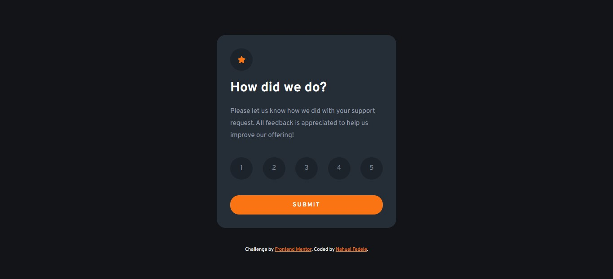

# ⭐ Interactive rating component

This is a solution to the [Interactive rating component challenge on Frontend Mentor](https://www.frontendmentor.io/challenges/interactive-rating-component-koxpeBUmI). Frontend Mentor challenges help you improve your coding skills by building realistic projects.

---

### 📌 Links

- Solution URL: [GitHub](https://github.com/NahuelEF/rating-component.git)
- Live Site URL: [GitHub Pages](https://nahuelef.github.io/rating-component/)

## 🎯 The challenge

Users should be able to:

- [x] View the optimal layout for the app depending on their device's screen size
- [x] See hover states for all interactive elements on the page
- [x] Select and submit a number rating
- [x] See the "Thank you" card state after submitting a rating

## 🛠 Built with

- Semantic HTML5 markup
- CSS custom properties
- Flexbox
- CSS Grid
- Vanilla JavaScript

## 👨‍💻 Author

- Frontend Mentor - [@NahuelEF](https://www.frontendmentor.io/profile/NahuelEF)
